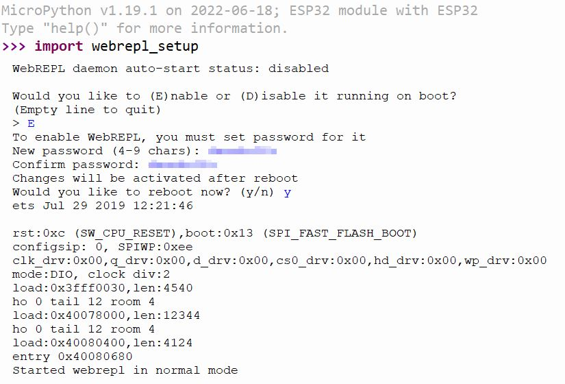

# ESP32 LED-Strips Control
Lighting for our Observatory with LED-Stripes

What we need:
Software:

* MicroPython IDE
  * https://thonny.org/ 
  * or choco install thonny
  
* MicroPython Firmware
  * https://micropython.org/download/esp32/

* Windows Diver for ESP32
  * https://www.silabs.com/developers/usb-to-uart-bridge-vcp-drivers?tab=downloads
  * https://www.silabs.com/documents/public/software/CP210x_Windows_Drivers.zip

* Pinout ESP32 WROOM
  https://randomnerdtutorials.com/esp32-pinout-reference-gpios/
* 

Hardware:

* ESP 32

  https://www.az-delivery.de/products/esp32-d1-mini?variant=32437195505760


Tutorial 4 MicroPython: 

* https://www.youtube.com/watch?v=elBtWZ_fOZU

Steps:
pip install esptool
esptool.py --port /dev/ttyUSB0 erase_flash
https://micropython.org/download/esp32/ --> downloads --> https://micropython.org/resources/firmware/esp32-20220618-v1.19.1.bin
esptool.py --chip esp32 --port /dev/ttyUSB0 write_flash -z 0x1000 ~/Downloads/esp32-20220618-v1.19.1.bin

After that Python is ready to run on the ESP32


After booting, the ESP32 with MicroPython will execute 2 files - boot.py and main.py, by this order. If boot.py exists, it´s executed first and then main.py.

If you want something to be executed at boot, put the code in main.py or boot.py

To execute the code every time the ESP32 turns on, we should put the above code in a file named main.py or boot.py and copy it to the ESP32

try: 
```python
import machine
import time
led = machine.Pin(2, machine.Pin.OUT)
while True:
	led.value(1)
	time.sleep(1)
	led.value(0)
	time.sleep(1)
```


At this point in time, you will be able to enable WebREPL on your ESP32 board. In order to do so, enter the following Python codes into the REPL prompt:

```python
import webrepl_setup
```



Edit the file on the ESP: boot.py
```python
ssid = 'www.hagenfragen.de'
password = 'i-do-not-tell-ya'
import network
import webrepl
def do_connect(ssid, pwd):
    sta_if = network.WLAN(network.STA_IF)
    if not sta_if.isconnected():
        print('connecting to network...')
        sta_if.active(True)
        sta_if.connect(ssid, pwd)
        while not sta_if.isconnected():
            pass
    print('network config:', sta_if.ifconfig())
 
# This file is executed on every boot (including wake-boot from deepsleep)
#import esp
#esp.osdebug(None)
 
# Attempt to connect to WiFi network
do_connect(ssid, password)
webrepl.start()
```

Now we can work with the ESP32 remotely via IP.

Why stop here? Now we go for the webserver 
