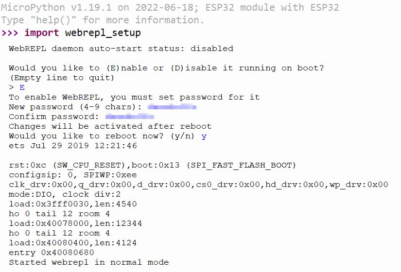

# ESP32 LED-Strips Control — Sternwarte Höfingen

> **[Deutsch](#deutsch)** · **[English](#english)**

---

<a name="deutsch"></a>
## 🇩🇪 Deutsch

### Projektbeschreibung

Steuerung der Beleuchtung der [Sternwarte Höfingen](https://www.sternwarte-hoefingen.de) über drei RGB-LED-Streifen an einem ESP32. Das System unterstützt rotes Beobachtungslicht (schonend für die Dunkeladaption) und weißes Allgemeinlicht. Helligkeit und Farbe sind über Drucktasten, einen Drehgeber und eine eingebaute Weboberfläche (Port 80) einstellbar. Ein DHT11-Sensor misst Temperatur und Luftfeuchtigkeit und zeigt sie im Web-UI an.

---

### Hardware

| Komponente | Beschreibung |
|---|---|
| ESP32 AZ-Delivery D1 Mini | Hauptcontroller |
| 3× RGB-LED-Streifen | Common-cathode, PWM-gesteuert |
| 2× Drucktaster (NO) | Weiß-/Rotlicht-Toggle |
| 1× Drehgeber mit Taster | Helligkeit |
| 1× DHT11 | Temperatur + Luftfeuchtigkeit |

#### GPIO-Belegung

| GPIO | Signal | Komponente |
|---|---|---|
| 0 | DHT DATA | DHT11 |
| 27 | STRIP 1 R | LED-Strip 1 Rot |
| 25 | STRIP 1 G | LED-Strip 1 Grün |
| 32 | STRIP 1 B | LED-Strip 1 Blau |
| 22 | STRIP 2 R | LED-Strip 2 Rot |
| 21 | STRIP 2 G | LED-Strip 2 Grün |
| 17 | STRIP 2 B | LED-Strip 2 Blau |
| 19 | STRIP 3 R | LED-Strip 3 Rot |
| 18 | STRIP 3 G | LED-Strip 3 Grün |
| 26 | STRIP 3 B | LED-Strip 3 Blau |
| 13 | BUTTON_W | Weiß-Taster (T1) |
| 10 | BUTTON_R | Rot-Taster (T2) |
| 14 | BUTTON_D | Drehgeber-Taster |
| 33 | CLK | Drehgeber CLK |
| 34 | DT | Drehgeber DT |
| 2 | LED | Onboard-LED (Status) |

#### Verdrahtungsdiagramm


```mermaid
graph TD
    subgraph ESP32["ESP32 D1 Mini"]
        G0["GPIO 0"]
        G2["GPIO 2"]
        G10["GPIO 10"]
        G13["GPIO 13"]
        G14["GPIO 14"]
        G17["GPIO 17"]
        G18["GPIO 18"]
        G19["GPIO 19"]
        G21["GPIO 21"]
        G22["GPIO 22"]
        G25["GPIO 25"]
        G26["GPIO 26"]
        G27["GPIO 27"]
        G32["GPIO 32"]
        G33["GPIO 33"]
        G34["GPIO 34"]
    end

    DHT11["DHT11\nTemp + Humidity"]
    BW["Button Weiß\n(T1, PULL_UP)"]
    BR["Button Rot\n(T2, PULL_UP)"]
    BD["Rotary SW\n(PULL_UP)"]
    RCLK["Rotary CLK\n(IRQ)"]
    RDT["Rotary DT\n(IRQ)"]
    ONBLED["Onboard LED"]

    subgraph Strip1["LED Strip 1"]
        S1R["Red"]
        S1G["Green"]
        S1B["Blue"]
    end
    subgraph Strip2["LED Strip 2"]
        S2R["Red"]
        S2G["Green"]
        S2B["Blue"]
    end
    subgraph Strip3["LED Strip 3"]
        S3R["Red"]
        S3G["Green"]
        S3B["Blue"]
    end

    G0  -->|DATA| DHT11
    G2  --> ONBLED
    G13 -->|IN| BW
    G10 -->|IN| BR
    G14 -->|IN| BD
    G33 -->|IN| RCLK
    G34 -->|IN| RDT
    G27 -->|PWM| S1R
    G25 -->|PWM| S1G
    G32 -->|PWM| S1B
    G22 -->|PWM| S2R
    G21 -->|PWM| S2G
    G17 -->|PWM| S2B
    G19 -->|PWM| S3R
    G18 -->|PWM| S3G
    G26 -->|PWM| S3B
```

---

### Licht-Logik

| Aktion | Ergebnis |
|---|---|
| Weiß-Taster (kurz) | Weißlicht ON/OFF (Rot hat Vorrang) |
| Rot-Taster (kurz) | Rotlicht ON; schaltet Weiß ab wenn nötig |
| Weiß-Taster (lang >5 s) | Reset: Weißlicht volle Helligkeit (1023) |
| Rot-Taster (lang >5 s) | Reset: Rotlicht volle Helligkeit (1023) |
| Drehgeber rechts | Helligkeit erhöhen (2^Wert, max 1024) |
| Drehgeber links | Helligkeit verringern |

PWM-Frequenz: **7321 Hz** (Primzahl, verhindert Moire-Artefakte in Kameras und Augen)

---

### Software / Abhängigkeiten

| | |
|---|---|
| MicroPython-Firmware | ≥ v1.19.1 für ESP32 |
| `dht` | Built-in in MicroPython |
| `ujson` | Built-in in MicroPython |
| `network` | Built-in in MicroPython |
| `rotary.py` | Mitgeliefert (MIT License, Mike Teachman) |

---

### Konfiguration

#### Konstanten in `config.json`

Konstanten können in `config.json` angepasst werden (Fallback auf Defaults bei Fehler):

| Konstante | Standardwert | Beschreibung |
|---|---|---|
| `LOOP_MS` | `100` | Haupt-Loop-Takt in ms (10 Hz) |
| `WIFI_CHECK_TICKS` | `300` | WiFi-Check alle 300 × 100 ms = 30 s |
| `Brightness` | `1024` | Anfangshelligkeit (0–1023) |
| `Fade_speed` | `16` | Fade-Schrittgröße pro Timer-Tick |
| `DebugLevel` | `4` | Debug-Level (0=none, 4=verbose) |

---
| `DebugLevel` | `4` | 0=keine, 1=Fehler, 2=Warn, 3=Info, 4=verbose |

WDT-Timeout: **15 000 ms** (> WiFi-Connect-Timeout von 10 000 ms).

#### Secrets-Datei

Lege `secrets_wifi.json` auf dem Gerät an (Format wie `secrets_wifi_example.json`):

```json
{
    "MeinHeimnetzwerk": "MeinPasswort",
    "FallbackSSID": "FallbackPasswort"
}
```

Das Gerät scannt verfügbare Netze und verbindet sich automatisch mit dem ersten bekannten SSID.

---

### WebREPL

Einmalige Einrichtung (einmalig im REPL):

```python
import webrepl_setup
```

Passwort wird in `webrepl_cfg.py` gespeichert (Standard: `1234` – **bitte ändern**).

Danach erreichbar unter: `ws://<IP des ESP32>:8266`  
Tool: [http://micropython.org/webrepl/](http://micropython.org/webrepl/)

---

### Weboberfläche

| URL-Pfad | Funktion |
|---|---|
| `/` | Haupt-UI (HTML) |
| `/?red=on` / `/?red=off` | Rotlicht ein/aus |
| `/?white=on` / `/?white=off` | Weißlicht ein/aus |
| `/?r=R&g=G&b=B` | RGB-Wert direkt setzen (0–255) |
| `/data.json` | Aktueller Status als JSON |
| `/web.css` | Stylesheet |
| `/debug.html` | Live-Debug-Log |
| `/logs.html` | Separate Logs-Webseite |
| `/logs.json` | Logs als JSON für Polling |

---

### Dateistruktur

```
code/
├── boot.py                  # Startup: startet WebREPL
├── main.py                  # Hauptanwendung (GPIO, Webserver, Loop)
├── config.json              # Konfigurationsdatei für Konstanten
├── class_pwm.py             # RGB-LED-Strip PWM-Treiber
├── class_debounce.py        # Software-Entprellung für Tasten
├── class_debug.py           # Ring-Buffer Debug-Logger
├── class_humidity_sensor.py # DHT11-Treiber
├── class_wifi_connection.py # Multi-SSID WiFi-Manager
├── class_rotary_encoder.py  # Drehgeber (ESP32 IRQ)
├── rotary.py                # Plattformunabhängige Basis-Klasse (extern)
├── rotary_encoder.py        # Standalone-Beispiel (nicht im Hauptpfad)
├── rotary_irq_esp.py        # Standalone-Beispiel (nicht im Hauptpfad)
├── web_html.py              # HTML/CSS/Debug-Templates
├── webrepl_cfg.py           # WebREPL-Passwort
└── secrets_wifi_example.json # Beispiel für WiFi-Zugangsdaten
```

---

### Flash / Deployment

**Firmware flashen (einmalig):**

```bash
pip install esptool
esptool.py --chip esp32 --port /dev/ttyUSB0 erase_flash
esptool.py --chip esp32 --port /dev/ttyUSB0 write_flash -z 0x1000 \
    esp32-20220618-v1.19.1.bin
```

**Dateien übertragen (mpremote):**

```bash
pip install mpremote
mpremote connect /dev/ttyUSB0 cp code/secrets_wifi.json :secrets_wifi.json
mpremote connect /dev/ttyUSB0 cp code/boot.py :boot.py
mpremote connect /dev/ttyUSB0 cp code/main.py :main.py
mpremote connect /dev/ttyUSB0 cp code/class_*.py :/
mpremote connect /dev/ttyUSB0 cp code/rotary.py :rotary.py
mpremote connect /dev/ttyUSB0 cp code/web_html.py :web_html.py
mpremote connect /dev/ttyUSB0 cp code/webrepl_cfg.py :webrepl_cfg.py
```

**Alternativ mit Thonny:** [https://thonny.org/](https://thonny.org/)

---

### Bekannte Einschränkungen / TODOs

- `Strip3` wird in der aktuellen Hauptschleife nicht über den Webserver-RGB-Pfad gesetzt (nur Strip 1 und 2). Geplant: Übergabe einer Strip-Liste.
- RGB-Eingabe im Web-UI akzeptiert Werte 0–255; intern wird 0–1023 verwendet (PWM-Auflösung ESP32). Die Webserver-Validierung begrenzt auf 255 — für volle Auflösung Code anpassen.
- `rotary_encoder.py` und `rotary_irq_esp.py` sind Standalone-Beispiele und kein Bestandteil des Hauptprogramms — können vom Gerät gelöscht werden.

---

### Changelog

Siehe [CHANGELOG.md](CHANGELOG.md).

---

### Lizenz

Siehe [LICENSE](LICENSE).

---
---

<a name="english"></a>
## 🇬🇧 English

### Project Description

Controls the lighting of the [Sternwarte Höfingen observatory](https://www.sternwarte-hoefingen.de) via three RGB LED strips driven by an ESP32. The system supports red observation light (preserves dark adaption) and white general lighting. Brightness and colour are adjustable via push buttons, a rotary encoder, and a built-in web interface on port 80. A DHT11 sensor measures ambient temperature and humidity, displayed in the web UI.

---

### Hardware

| Component | Description |
|---|---|
| ESP32 AZ-Delivery D1 Mini | Main controller |
| 3× RGB LED strip | Common-cathode, PWM-controlled |
| 2× push button (NO) | White/red light toggle |
| 1× rotary encoder with button | Brightness |
| 1× DHT11 | Temperature + humidity |

#### GPIO mapping

| GPIO | Signal | Component |
|---|---|---|
| 0 | DHT DATA | DHT11 |
| 27 | STRIP 1 R | LED Strip 1 Red |
| 25 | STRIP 1 G | LED Strip 1 Green |
| 32 | STRIP 1 B | LED Strip 1 Blue |
| 22 | STRIP 2 R | LED Strip 2 Red |
| 21 | STRIP 2 G | LED Strip 2 Green |
| 17 | STRIP 2 B | LED Strip 2 Blue |
| 19 | STRIP 3 R | LED Strip 3 Red |
| 18 | STRIP 3 G | LED Strip 3 Green |
| 26 | STRIP 3 B | LED Strip 3 Blue |
| 13 | BUTTON_W | White button (T1) |
| 10 | BUTTON_R | Red button (T2) |
| 14 | BUTTON_D | Rotary encoder push button |
| 33 | CLK | Rotary encoder CLK |
| 34 | DT | Rotary encoder DT |
| 2 | LED | On-board LED (status) |

#### Wiring Diagram


```mermaid
graph TD
    subgraph ESP32["ESP32 D1 Mini"]
        G0["GPIO 0"]
        G2["GPIO 2"]
        G10["GPIO 10"]
        G13["GPIO 13"]
        G14["GPIO 14"]
        G17["GPIO 17"]
        G18["GPIO 18"]
        G19["GPIO 19"]
        G21["GPIO 21"]
        G22["GPIO 22"]
        G25["GPIO 25"]
        G26["GPIO 26"]
        G27["GPIO 27"]
        G32["GPIO 32"]
        G33["GPIO 33"]
        G34["GPIO 34"]
    end

    DHT11["DHT11\nTemp + Humidity"]
    BW["Button White\n(T1, PULL_UP)"]
    BR["Button Red\n(T2, PULL_UP)"]
    BD["Rotary SW\n(PULL_UP)"]
    RCLK["Rotary CLK\n(IRQ)"]
    RDT["Rotary DT\n(IRQ)"]
    ONBLED["Onboard LED"]

    subgraph Strip1["LED Strip 1"]
        S1R["Red"]
        S1G["Green"]
        S1B["Blue"]
    end
    subgraph Strip2["LED Strip 2"]
        S2R["Red"]
        S2G["Green"]
        S2B["Blue"]
    end
    subgraph Strip3["LED Strip 3"]
        S3R["Red"]
        S3G["Green"]
        S3B["Blue"]
    end

    G0  -->|DATA| DHT11
    G2  --> ONBLED
    G13 -->|IN| BW
    G10 -->|IN| BR
    G14 -->|IN| BD
    G33 -->|IN| RCLK
    G34 -->|IN| RDT
    G27 -->|PWM| S1R
    G25 -->|PWM| S1G
    G32 -->|PWM| S1B
    G22 -->|PWM| S2R
    G21 -->|PWM| S2G
    G17 -->|PWM| S2B
    G19 -->|PWM| S3R
    G18 -->|PWM| S3G
    G26 -->|PWM| S3B
```

---

### Light Logic

| Action | Result |
|---|---|
| White button (short) | Toggle white light ON/OFF (red takes priority) |
| Red button (short) | Red light ON; switches white off if needed |
| White button (long >5 s) | Reset: white light full brightness (1023) |
| Red button (long >5 s) | Reset: red light full brightness (1023) |
| Rotary encoder CW | Increase brightness (2^value, max 1024) |
| Rotary encoder CCW | Decrease brightness |

PWM frequency: **7321 Hz** (prime number, avoids moiré artefacts in cameras and eyes).

---

### Software / Dependencies

| | |
|---|---|
| MicroPython firmware | ≥ v1.19.1 for ESP32 |
| `dht` | Built-in MicroPython |
| `ujson` | Built-in MicroPython |
| `network` | Built-in MicroPython |
| `rotary.py` | Bundled (MIT License, Mike Teachman) |

---

### Configuration

#### Constants in `main.py`

| Constant | Default | Description |
|---|---|---|
| `LOOP_MS` | `100` | Main loop interval in ms (10 Hz) |
| `WIFI_CHECK_TICKS` | `600` | WiFi health check every 600 × 100 ms = 60 s |
| `Brightness` | `1024` | Initial brightness (0–1023) |
| `Fade_speed` | `16` | Fade step size per timer tick |
| `DebugLevel` | `4` | 0=none, 1=error, 2=warn, 3=info, 4=verbose |

WDT timeout: **15 000 ms** (> WiFi connect timeout of 10 000 ms).

#### Secrets file

Create `secrets_wifi.json` on the device (format as in `secrets_wifi_example.json`):

```json
{
    "MyHomeNetwork": "MyPassword",
    "FallbackSSID": "FallbackPassword"
}
```

The device scans for available networks and connects to the first known SSID.

---

### WebREPL

One-time setup (run once in REPL):

```python
import webrepl_setup
```

The password is stored in `webrepl_cfg.py` (default: `1234` — **please change**).

Then accessible at: `ws://<ESP32 IP>:8266`  
Tool: [http://micropython.org/webrepl/](http://micropython.org/webrepl/)

---

### Web Interface

| URL path | Function |
|---|---|
| `/` | Main control UI (HTML) |
| `/?red=on` / `/?red=off` | Red light on/off |
| `/?white=on` / `/?white=off` | White light on/off |
| `/?r=R&g=G&b=B` | Set RGB directly (0–255) |
| `/data.json` | Current state as JSON |
| `/web.css` | Stylesheet |
| `/debug.html` | Live debug log |

---

### File Structure

```
code/
├── boot.py                  # Startup: starts WebREPL
├── main.py                  # Main application (GPIO, webserver, loop)
├── class_pwm.py             # RGB LED strip PWM driver
├── class_debounce.py        # Software button debounce
├── class_debug.py           # Ring-buffer debug logger
├── class_humidity_sensor.py # DHT11 driver
├── class_wifi_connection.py # Multi-SSID WiFi manager
├── class_rotary_encoder.py  # Rotary encoder (ESP32 IRQ)
├── rotary.py                # Platform-independent base class (3rd party)
├── rotary_encoder.py        # Standalone example (not in main path)
├── rotary_irq_esp.py        # Standalone example (not in main path)
├── web_html.py              # HTML/CSS/debug templates
├── webrepl_cfg.py           # WebREPL password
└── secrets_wifi_example.json # Example WiFi credentials
```

---

### Flash / Deployment

**Flash firmware (once):**

```bash
pip install esptool
esptool.py --chip esp32 --port /dev/ttyUSB0 erase_flash
esptool.py --chip esp32 --port /dev/ttyUSB0 write_flash -z 0x1000 \
    esp32-20220618-v1.19.1.bin
```

**Transfer files (mpremote):**

```bash
pip install mpremote
mpremote connect /dev/ttyUSB0 cp code/secrets_wifi.json :secrets_wifi.json
mpremote connect /dev/ttyUSB0 cp code/boot.py :boot.py
mpremote connect /dev/ttyUSB0 cp code/main.py :main.py
mpremote connect /dev/ttyUSB0 cp code/class_*.py :/
mpremote connect /dev/ttyUSB0 cp code/rotary.py :rotary.py
mpremote connect /dev/ttyUSB0 cp code/web_html.py :web_html.py
mpremote connect /dev/ttyUSB0 cp code/webrepl_cfg.py :webrepl_cfg.py
```

**Alternatively with Thonny:** [https://thonny.org/](https://thonny.org/)

---

### Known Limitations / TODOs

- `Strip3` is not updated via the web-UI RGB path (only Strip 1 and 2). Planned: pass a strip list as a parameter.
- The web UI RGB inputs accept 0–255; internally 0–1023 is used (ESP32 PWM resolution). For full resolution, update the web-server validation.
- `rotary_encoder.py` and `rotary_irq_esp.py` are standalone examples and not part of the main application — they can be deleted from the device.

---

### Changelog

See [CHANGELOG.md](CHANGELOG.md).

---

### License

See [LICENSE](LICENSE).


What we need:
Software:

* MicroPython IDE
  * https://thonny.org/ 
  * or choco install thonny
  
* MicroPython Firmware
  * https://micropython.org/download/esp32/

* Windows Diver for ESP32
  * https://www.silabs.com/developers/usb-to-uart-bridge-vcp-drivers?tab=downloads
  * https://www.silabs.com/documents/public/software/CP210x_Windows_Drivers.zip

* Pinout ESP32 WROOM
  https://randomnerdtutorials.com/esp32-pinout-reference-gpios/
* 

Hardware:

* ESP 32

  https://www.az-delivery.de/products/esp32-d1-mini?variant=32437195505760


Tutorial 4 MicroPython: 

* https://www.youtube.com/watch?v=elBtWZ_fOZU

Steps:
pip install esptool
esptool.py --port /dev/ttyUSB0 erase_flash
https://micropython.org/download/esp32/ --> downloads --> https://micropython.org/resources/firmware/esp32-20220618-v1.19.1.bin
esptool.py --chip esp32 --port /dev/ttyUSB0 write_flash -z 0x1000 ~/Downloads/esp32-20220618-v1.19.1.bin

After that Python is ready to run on the ESP32


After booting, the ESP32 with MicroPython will execute 2 files - boot.py and main.py, by this order. If boot.py exists, it´s executed first and then main.py.

If you want something to be executed at boot, put the code in main.py or boot.py

To execute the code every time the ESP32 turns on, we should put the above code in a file named main.py or boot.py and copy it to the ESP32

try: 
```python
import machine
import time
led = machine.Pin(2, machine.Pin.OUT)
while True:
	led.value(1)
	time.sleep(1)
	led.value(0)
	time.sleep(1)
```


At this point in time, you will be able to enable WebREPL on your ESP32 board. In order to do so, enter the following Python codes into the REPL prompt:

```python
import webrepl_setup
```



Edit the file on the ESP: boot.py
```python
ssid = 'www.hagenfragen.de'
password = 'i-do-not-tell-ya'
import network
import webrepl
def do_connect(ssid, pwd):
    sta_if = network.WLAN(network.STA_IF)
    if not sta_if.isconnected():
        print('connecting to network...')
        sta_if.active(True)
        sta_if.connect(ssid, pwd)
        while not sta_if.isconnected():
            pass
    print('network config:', sta_if.ifconfig())
 
# This file is executed on every boot (including wake-boot from deepsleep)
#import esp
#esp.osdebug(None)
 
# Attempt to connect to WiFi network
do_connect(ssid, password)
webrepl.start()
```

Now we can work with the ESP32 remotely via IP.

Why stop here? Now we go for the webserver 
